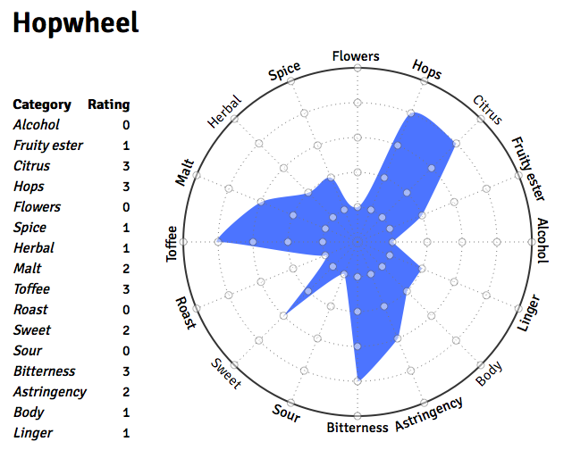

Inspired by an analog version I saw in a brewery, Hopwheel allows users to rate a particular beer using a number of categories. Because the category axes form an interactive radar chart (using D3.js), each beer has a unique image shape for each user.

Eventually this project, designed for mobile use, will allow multiple users to keep track of beers they've tried as well as provide recommendations based on the beer profiles from others.

